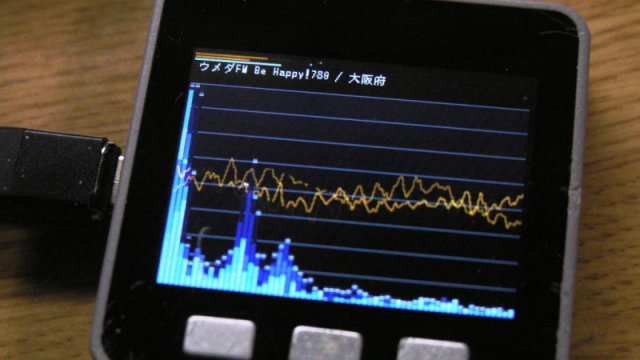

# WebRadio_Jcbbsimul

### 機能
- [WebRadio_with_ESP8266Audio](https://github.com/m5stack/M5Unified/tree/master/examples/Advanced/WebRadio_with_ESP8266Audio) をベースにして、[JCBAインターネットサイマルラジオ](https://www.jcbasimul.com/)が聴けるようにしました。
- 2022年4月時点で公開されている全132局を網羅しています。
- 試験的に[リリースパッケージ](release/)も用意しました。Arduino 環境のない方でもインストールできるはず。
- 選局と音量は不揮発性メモリに保存され、次回の起動時に初期採用されます。

### 操作方法
|ボタン|動作|
|:-------------:|:----:|
|Aボタン1回クリック|選局・次|
|Aボタン2回クリック|選局・前|
|Bボタン|音量・減|
|Cボタン|音量・増|

### 各自で調整するとよい箇所
全132局を網羅したため、あまりに多すぎて選局が大変です。  
Arduino のビルド環境が必要とはなりますが、不要な局はコメント行にして必要最小限にすると快適になるかと思います。

### ビルドに必要なライブラリ
- [m5stack/M5GFX](https://github.com/m5stack/M5GFX)
- [m5stack/M5Unified](https://github.com/m5stack/M5Unified)
- [earlephilhower/ESP8266Audio](https://github.com/earlephilhower/ESP8266Audio)
- [Links2004/arduinoWebSockets](https://github.com/Links2004/arduinoWebSockets)
- [arduino-libraries/Arduino_JSON](https://github.com/arduino-libraries/Arduino_JSON)

### ペンディング中
- WiFiの初期設定(接続情報を記録したSDカードを利用する案が濃厚)
- 番組名も取得可能と思われるが調査中
- 切断後の自動再接続(実装によってはDDoSになりかねないため躊躇してる)

### 謝辞
かっこいいビジュアルは [lovyan03](https://github.com/lovyan03/) さんの制作です。  
ずっと見てても飽きないですよね！
